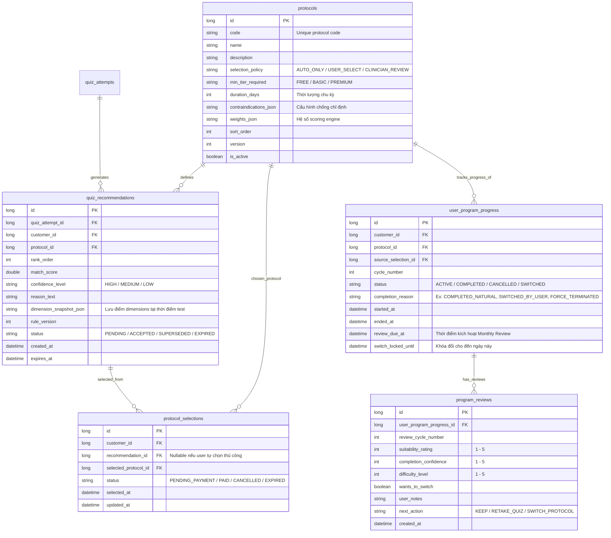

# Protocol Recommendation & Monthly Review Plan (Phiên bản Cải tiến)

Bản kế hoạch này định nghĩa kiến trúc phát triển cho hệ thống gợi ý phác đồ điều trị/hỗ trợ (Protocols) dựa trên Quiz và cơ chế Đánh giá chu kỳ hàng tháng (Monthly Review). Tài liệu này được cải tiến dựa trên các phản hồi thực tế để đảm bảo hệ thống khuyến nghị đúng người, dữ liệu bền vững, và quy trình nghiệp vụ chặt chẽ.

---

## 1. Hiện tại code đã có gì

### Quiz
- User làm quiz nhiều lần, mỗi lần lưu `quiz_attempts` và `user_answers`.
- Kết quả quiz trả về: `totalScore`, `assessmentResult`, `overallAssessment`.
- Logic chấm điểm dựa trên `QuizAssessmentRule` theo khoảng điểm cố định (total score).
- **File chính:**
  - [QuizServiceImpl.java](file:///d:/ky7/exe-project/backend/src/main/java/com/product/exe/backend/service/impl/QuizServiceImpl.java)
  - [QuizAttempt.java](file:///d:/ky7/exe-project/backend/src/main/java/com/product/exe/backend/entity/QuizAttempt.java)
  - [QuizResultResponse.java](file:///d:/ky7/exe-project/backend/src/main/java/com/product/exe/backend/dto/response/QuizResultResponse.java)
  - [QuizRunnerPage.jsx](file:///d:/ky7/exe-project/frontend/src/pages/customer/quizzes/QuizRunnerPage.jsx)

### Subscription
- Hệ thống phân loại gói `FREE / BASIC / PREMIUM ...` theo `SubscriptionTier`.
- Quyền truy cập phác đồ hiện tại chỉ check theo tier, chưa gắn với từng phác đồ cụ thể.
- **File chính:**
  - [SubscriptionPlan.java](file:///d:/ky7/exe-project/backend/src/main/java/com/product/exe/backend/entity/SubscriptionPlan.java)
  - [UserSubscription.java](file:///d:/ky7/exe-project/backend/src/main/java/com/product/exe/backend/entity/UserSubscription.java)
  - [SubscriptionServiceImpl.java](file:///d:/ky7/exe-project/backend/src/main/java/com/product/exe/backend/service/impl/SubscriptionServiceImpl.java)

### Program / Phác đồ
- Mỗi customer chỉ có **1 lộ trình active duy nhất**.
- `UserProgramProgress` đang thiết kế dạng 1-1 với `customer_id`.
- Chức năng enroll chỉ tạo hoặc lấy đúng 1 progress đang có.
- Hỗ trợ: xem progress, week detail, toggle task, daily/weekly logs, resume/restart.
- **File chính:**
  - [UserProgramProgress.java](file:///d:/ky7/exe-project/backend/src/main/java/com/product/exe/backend/entity/UserProgramProgress.java)
  - [ProgramServiceImpl.java](file:///d:/ky7/exe-project/backend/src/main/java/com/product/exe/backend/service/impl/ProgramServiceImpl.java)
  - [CustomerProgramController.java](file:///d:/ky7/exe-project/backend/src/main/java/com/product/exe/backend/controller/customer/CustomerProgramController.java)
  - [ProgramLayout.jsx](file:///d:/ky7/exe-project/frontend/src/pages/customer/program/ProgramLayout.jsx)

---

## 2. Đánh giá tổng quan & Định hướng cải tiến

### Điểm mạnh của định hướng hiện tại
1. **Tách biệt Recommendation & Active Protocol:** Kết quả quiz mới không làm gián đoạn lộ trình hiện tại của user.
2. **Cho phép quiz lại giữa chừng:** User có thể kiểm tra sức khỏe bất kỳ lúc nào nhưng không tự ý nhảy phác đồ ngay lập tức.
3. **Monthly Review:** Tạo điểm chạm hợp lý cuối mỗi chu kỳ (30 ngày) để người dùng quyết định tiếp tục hay chuyển đổi.
4. **Triển khai theo phase:** Phân chia hợp lý để giảm thiểu rủi ro khi thay đổi quá nhiều database entity và API cùng lúc.

### Các điểm cần cải tiến quan trọng
- **Engine-level Logic:** Cần thiết kế Engine tính toán điểm dựa trên nhiều khía cạnh (dimensions) thay vì chỉ ánh xạ theo tổng điểm (total score).
- **Eligibility Filters:** Bổ sung bộ lọc trước khi hiển thị phác đồ (Ví dụ: tier giới hạn, chống chỉ định, lịch sử tuân thủ).
- **Cải tiến Schema:** Lưu trữ snapshot của recommendation để phục vụ audit; phân tách trạng thái lựa chọn (selections) khỏi kết quả recommend; lưu trữ đầy đủ lịch sử lifecycle của progress.
- **Feedback Loop & Analytics:** Thu thập dữ liệu sử dụng để tinh chỉnh luật gợi ý về sau.

---

## 3. Protocol Recommendation Engine & Scoring Logic

Hệ thống sẽ chuyển dịch từ chấm điểm tuyến tính (Total Score Ranges) sang **Multi-dimension Scoring (Chấm điểm đa chiều)** kết hợp **Eligibility Filtering**.

### 3.1. Quiz Result DTO Mở rộng
Mỗi lượt Quiz cần phân tích câu trả lời theo các nhóm triệu chứng / chiều kích (Dimensions):
- **Severity Score (Mức độ nghiêm trọng):** Triệu chứng thể chất/tâm lý.
- **Motivation/Readiness Score (Động lực & Sẵn sàng):** Mức độ quyết tâm thay đổi.
- **Adherence Risk (Nguy cơ không tuân thủ):** Mức độ kỷ luật, lịch sử bỏ dở.
- **Lifestyle Constraint (Giới hạn lối sống):** Thời gian rảnh, điều kiện làm việc.

```json
{
  "totalScore": 18,
  "assessmentResult": "MODERATE",
  "dimensionScores": {
    "severity": 8,
    "motivation": 4,
    "adherenceRisk": 7,
    "lifestyleConstraint": 5
  },
  "riskFlags": {
    "highRelapseRisk": true,
    "needsGuidedPlan": false
  },
  "recommendedProtocols": [
    {
      "protocolId": 2,
      "protocolCode": "P_MODERATE_GUIDED",
      "matchScore": 85.5,
      "priorityOrder": 1,
      "confidenceLevel": "HIGH",
      "reasonText": "Điểm triệu chứng ở mức trung bình, nhưng nguy cơ không tuân thủ cao nên phác đồ có hướng dẫn (Guided) sẽ giúp bạn duy trì kỷ luật tốt hơn."
    }
  ]
}
```

### 3.2. Công thức Recommendation Scoring (Đề xuất)
Mỗi Protocol $P_i$ trong hệ thống sẽ được cấu hình các hệ số trọng số (Weights) ứng với từng chiều điểm:

$$\text{MatchScore}(P_i) = w_{sev} \cdot S_{sev} + w_{mot} \cdot S_{mot} + w_{adh} \cdot S_{adh} + \text{historyAdjustment} + \text{eligibilityAdjustment}$$

*Trong đó:*
- $S_{sev}, S_{mot}, S_{adh}$ là điểm số của user trên từng dimension (quy đổi về thang 0-10 hoặc 0-100).
- $w_{sev}, w_{mot}, w_{adh}$ là trọng số phù hợp cấu hình cho Protocol $P_i$ đó.
- $\text{historyAdjustment}$: Điều chỉnh dựa trên lịch sử (ví dụ: trừ điểm nếu user đã từng thất bại ở phác đồ này 2 lần liên tiếp).

### 3.3. Bộ lọc Đủ điều kiện (Eligibility / Suitability Filters)
Trước khi chấm điểm, hệ thống chạy qua các bộ lọc loại trừ (Hard Filters):
1. **Tier Eligibility:** Gói subscription hiện tại của user có đủ điều kiện dùng protocol này không (`min_tier_required`).
2. **Contraindications (Chống chỉ định):** Nếu user có các cờ nguy hiểm (`riskFlags` từ quiz hay hồ sơ bệnh lý), loại ngay lập tức các phác đồ không an toàn.
3. **Status Filter:** Chỉ chọn các protocol đang `is_active = true` và không bị `deprecated`.

---

## 4. Thiết kế Mô hình Dữ liệu (Database Schema)

Để đáp ứng tính linh hoạt và khả năng lưu vết lịch sử, cơ sở dữ liệu sẽ được thiết kế/cập nhật như sau:



### 4.1. Chi tiết bổ sung trường cho các bảng

> [!IMPORTANT]
> - **protocols**: Bổ sung `selection_policy` để linh hoạt giữa việc hệ thống tự chọn hoàn toàn, cho user chọn hay cần nhân viên y tế duyệt.
> - **quiz_recommendations**: Bắt buộc lưu `dimension_snapshot_json` và `rule_version` để sau này audit được lý do tại thời điểm đó hệ thống đề xuất phác đồ này dù rule sau này đã thay đổi.
> - **protocol_selections**: Tách biệt luồng chọn phác đồ ra khỏi tiến trình học để quản lý thanh toán trung gian, hạn chế việc thay đổi trạng thái trực tiếp trên bảng khuyến nghị hoặc bảng tiến trình.
> - **user_program_progress**: Chuyển đổi từ mô hình 1-1 sang dạng lịch sử nhiều chu kỳ bằng cách thêm `status`, `cycle_number` và các trường thời gian kết thúc/khoá đổi.

---

## 5. Quy tắc Nghiệp vụ (Business Rules)

### 5.1. Quy tắc Khóa chuyển đổi (Lock duration)
- Khi user enroll vào một phác đồ, `switch_locked_until` sẽ được tính bằng thời gian hiện tại cộng với độ dài chu kỳ (Ví dụ: `duration_days` của phác đồ - mặc định 30 ngày).
- **Trước khi hết hạn khóa (`switch_locked_until`):** Hệ thống không cho phép user chuyển đổi sang phác đồ khác trên UI. Mọi hành vi gọi API chuyển đổi trực tiếp sẽ bị từ chối với mã lỗi `403 Forbidden`.
- **Trường hợp ngoại lệ:** Quản trị viên (Admin) hoặc bác sĩ/người hướng dẫn chuyên môn có quyền ghi đè cờ khóa này (`support override`) thông qua giao diện quản trị.

### 5.2. Giải quyết nhiều lượt test liên tục (Superseding)
- User có thể làm Quiz nhiều lần trong một chu kỳ đang chạy.
- Kết quả gợi ý từ lượt test mới nhất sẽ có trạng thái `PENDING`.
- Các bản ghi `quiz_recommendations` của các lượt test trước đó chưa được thanh toán/enroll sẽ tự động chuyển sang trạng thái `SUPERSEDED` (Bị thế chỗ).
- Khi tới kỳ review, hệ thống chỉ lấy **Latest Valid Recommendation** (Gợi ý hợp lệ gần nhất) làm phương án đề xuất chính thức cho chu kỳ tiếp theo.

### 5.3. Xử lý khoảng cách điểm sát nhau (Score Gaps)
- Nếu $MatchScore(A) - MatchScore(B) \le 5.0$ (khoảng cách điểm không đáng kể):
  - UI sẽ hiển thị cả hai phác đồ này với nhãn **"Phù hợp tương đương" (Equally Suitable)** thay vì khẳng định tuyệt đối một phác đồ tốt hơn.
  - Cho phép người dùng đọc chi tiết tính chất của từng cái để tự quyết định.
- Nếu khoảng cách điểm $> 5.0$:
  - UI làm nổi bật phác đồ có điểm cao nhất với nhãn **"Khuyên dùng nhất" (Highly Recommended)**.

### 5.4. Cơ chế Fallback an toàn
- Nếu Recommendation Engine không tìm thấy bất cứ phác đồ nào đáp ứng bộ lọc do điểm số quá thấp hoặc các cờ chống chỉ định phức tạp:
  - Trả về kết quả yêu cầu **"Cần chuyên gia đánh giá trực tiếp" (MANUAL_REVIEW_REQUIRED)**.
  - Gợi ý phác đồ mặc định (Default Protocol - thường là phác đồ cơ bản, tự học an toàn nhất) kèm theo cảnh báo khuyến nghị gặp chuyên gia.

---

## 6. Form đánh giá Chu kỳ hàng tháng (Monthly Review Form)

Khi đến ngày `review_due_at` của chu kỳ hiện tại, hệ thống sẽ mở khóa chức năng Review trên ứng dụng. User sẽ điền một bảng câu hỏi ngắn gồm:

| Field | Kiểu dữ liệu | Mô tả |
| :--- | :--- | :--- |
| `suitability_rating` | Integer (1 - 5) | Đánh giá mức độ phù hợp của phác đồ hiện tại. |
| `completion_confidence` | Integer (1 - 5) | Mức độ tự tin hoàn thành các mục tiêu đề ra. |
| `difficulty_level` | Integer (1 - 5) | Đánh giá độ khó của các nhiệm vụ hàng ngày. |
| `wants_to_switch` | Boolean | Có mong muốn đổi sang phác đồ khác không. |
| `next_action` | Enum | Quyết định: `KEEP` (Tiếp tục), `RETAKE_QUIZ` (Thiết lập lại qua quiz), `SWITCH_PROTOCOL` (Chuyển sang gợi ý dự phòng). |

Kết quả này sẽ lưu vào bảng `program_reviews` để làm dữ liệu đầu vào cho Recommendation Engine ở các chu kỳ sau.

---

## 7. Phân kỳ triển khai (Implementation Roadmap)

### Phase 1 — Dựng nền tảng Domain & Engine v1
- **Mục tiêu:** Sinh được khuyến nghị thật sự từ quiz dựa trên điểm đa chiều.
- **Backend:**
  - Viết script Migration tạo bảng `protocols` (với dữ liệu mẫu cho 3 phác đồ mới) và `quiz_recommendations`.
  - Triển khai Recommendation Engine trong `QuizServiceImpl` thực hiện tính toán điểm theo dimension, áp dụng bộ lọc và trả về danh sách xếp hạng.
  - Cập nhật DTO `QuizResultResponse` để chứa danh sách protocols gợi ý cùng với giải thích lý do (`reason_text`).
- **Frontend:**
  - Cập nhật [QuizRunnerPage.jsx](file:///d:/ky7/exe-project/frontend/src/pages/customer/quizzes/QuizRunnerPage.jsx) để render danh sách phác đồ được đề xuất, hiển thị lý do tại sao hệ thống lựa chọn phác đồ đó cho user.

### Phase 2 — Selection & Payment Linkage
- **Mục tiêu:** Tách biệt hành vi lựa chọn và thanh toán để đảm bảo quy trình nghiệp vụ sạch.
- **Backend:**
  - Thêm bảng `protocol_selections`.
  - Cập nhật API khi user bấm "Chọn phác đồ này" để tạo bản ghi selection ở trạng thái `PENDING_PAYMENT`.
  - Cập nhật luồng Webhook/IPN xử lý thanh toán thành công: Xác thực gói subscription phù hợp với phác đồ đã chọn, chuyển trạng thái selection thành `PAID` và tự động kích hoạt tiến trình enroll.

### Phase 3 — Protocol-Aware Progress
- **Mục tiêu:** Gắn chặt tiến trình học với một phác đồ cụ thể và quản lý chu kỳ học.
- **Backend:**
  - Cập nhật entity `UserProgramProgress` với các cột lifecycle: `protocol_id`, `cycle_number`, `status`, `review_due_at`, `switch_locked_until`.
  - Refactor `ProgramServiceImpl.enroll()` để khởi tạo tiến trình học cho đúng phác đồ được chọn trong bản ghi `protocol_selections` đã thanh toán.
- **Frontend:**
  - Sửa đổi giao diện Trang chủ Lộ trình học [ProgramLayout.jsx](file:///d:/ky7/exe-project/frontend/src/pages/customer/program/ProgramLayout.jsx) hiển thị rõ tên phác đồ hiện tại đang theo học.

### Phase 4 — Review Cycle & Switching
- **Mục tiêu:** Quản lý vòng đời hết hạn chu kỳ, khảo sát định kỳ và chuyển đổi phác đồ an toàn.
- **Backend:**
  - Viết API lưu trữ `program_reviews`.
  - Triển khai logic kiểm tra cờ khóa đổi phác đồ `switch_locked_until`. Chặn API chuyển đổi nếu chưa đến kỳ review (trừ trường hợp admin override).
  - Viết logic kết thúc chu kỳ cũ (`status = COMPLETED` hoặc `SWITCHED`), lưu lý do kết thúc, và khởi tạo chu kỳ mới với phác đồ mới nếu người dùng quyết định đổi.
- **Frontend:**
  - Tích hợp giao diện hiển thị Form khảo sát khi tiến trình của user đạt mốc `review_due_at`.
  - Hiển thị các nút hành động tương ứng: Duy trì phác đồ tiếp tục chu kỳ sau hoặc chuyển đổi.

### Phase 5 — Feedback Loop & Analytics
- **Mục tiêu:** Thu thập dữ liệu vận hành để nâng cao chất lượng đề xuất tự động.
- **Backend & DB:**
  - Lưu trữ các chỉ số chuyển đổi của khuyến nghị: Đề xuất có được click không? Có được thanh toán không? Tỷ lệ hoàn thành là bao nhiêu? Đánh giá độ phù hợp thực tế sau 30 ngày thế nào?
  - Xây dựng dashboard/báo cáo nội bộ về phân bố khuyến nghị và tỷ lệ bỏ phác đồ giữa chừng của từng nhóm đối tượng người dùng.

---

## 8. Những câu hỏi và Quyết định cần thống nhất

Để quá trình phát triển diễn ra mượt mà nhất, team cần chốt phương án cho các câu hỏi thiết kế sau:

> [!WARNING]
> 1. **Tiêu chí phân loại của 3 phác đồ mới là gì?**
>    - Cần xác định rõ 3 phác đồ mới phân biệt theo Độ nghiêm trọng triệu chứng (Nhẹ/Trung bình/Nặng), hay theo Mức độ hỗ trợ (Tự học/Có hướng dẫn từ xa/Có chuyên gia 1-1)?
> 2. **Hiển thị danh sách phác đồ như thế nào?**
>    - User sẽ được nhìn thấy toàn bộ Top 3 phác đồ kèm so sánh, hay hệ thống chỉ hiển thị duy nhất Phác đồ tốt nhất (Top 1) và ẩn các phương án còn lại để tránh gây bối rối?
> 3. **Mức độ ảnh hưởng của lịch sử lên Engine đề xuất?**
>    - Kết quả quiz mới nên chiếm 100% trọng số quyết định phác đồ, hay cần cộng thêm điểm phạt/điểm thưởng từ lịch sử (Ví dụ: Nếu user đã từng bỏ dở phác đồ A thì giảm độ ưu tiên của phác đồ A xuống)?
> 4. **Định nghĩa thời gian chu kỳ Review?**
>    - Kỳ review sẽ mặc định là tròn 30 ngày theo lịch (Calendar days), hay sẽ tính linh động theo tổng số ngày thực tế mà phác đồ đó yêu cầu hoàn thành (Duration days)?
> 5. **Quy trình Restart sẽ như thế nào?**
>    - Khi user bấm nút Restart lộ trình, hệ thống sẽ hiểu là bắt đầu lại chu kỳ hiện tại (Restart same cycle), bắt đầu chu kỳ mới với phác đồ cũ (Restart same protocol, new cycle) hay cho phép họ chọn phác đồ mới hoàn toàn?
> 6. **Liên kết chặt chẽ giữa Protocol và Tier?**
>    - Có bắt buộc phác đồ nâng cao phải khóa sau gói Premium không, hay bất kỳ user ở tier nào cũng có thể chọn mọi phác đồ, miễn là họ thanh toán riêng lẻ cho phác đồ đó?
